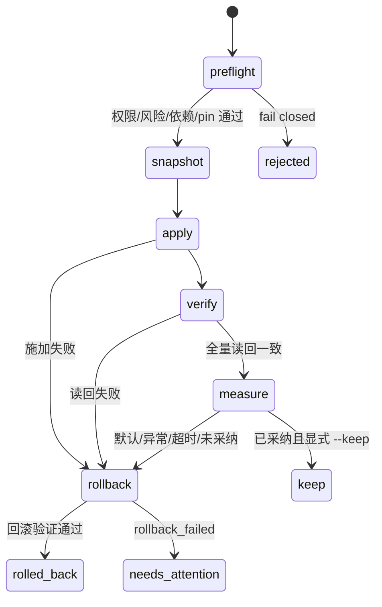
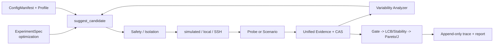

# System Optimizer

> M0 设计评审状态：本目录目前只有协议 README，没有 Python 实现。下面的 CLI、YAML 和输出是 M2 的目标合同，当前不可执行；用户确认 `docs/system-optimizer.md` 的 P0 决策后才进入 M1。

System Optimizer 在 Looper 既有 `optimization` 实验、候选搜索、worker 安全和统一证据链上增加 Linux CVM guest 配置的声明、施加、验证、回滚与审计。

## 定位与边界

两种能力：

- 通用优化：以 `benchmarks/system-probe` 的轻量探针搜索系统配置，输出带证据的 profile。探针只代表自身 CPU/内存/文件 I/O/loopback/syscall 特征，不代表生产 workload。
- 场景优化：绑定已安装 scenario benchmark，以主指标、SLO-goodput、尾延迟和稳定性做三层采纳判定，并把 Variability Analyzer 的线索作为候选排序先验。

明确不做：

- 不改 hypervisor 或宿主机，只处理 guest 内允许的状态。
- 不做应用代码、编译器或 kernel patch 优化。
- 不购买、启动或销毁云资源。
- 不做 always-on 调优 daemon；每轮默认回滚，只有用户对已采纳候选显式 `--keep` 才保留。
- M1–M5 不引入 RL/LLM 调参。

## Windows 快速开始（M2 目标，M0 尚不可运行）

M2 完成定义要求新用户在仓库根目录使用三条命令：

```powershell
pnpm install
pnpm setup
.venv\Scripts\looper.exe system-opt demo --backend simulated --output .looper\system-opt\demo
```

目标输出形态如下。这里是合同示意，不是 M0 实测摘录：

```text
backend=simulated target=simulated-windows
baseline: captured + verified
rounds: 10/10  stop=budget-exhausted
decision: pareto-candidate -> accepted-by-explicit-policy
final-state: rolled_back
profile: .looper\system-opt\demo\best-profile.yaml
report: .looper\system-opt\demo\report.md
evidence: .looper\system-opt\demo\evidence.zip
```

M2 必须用真实命令输出替换本段，并在 `docs/system-optimizer-demo.md` 留运行记录。

## 两种模式的最小配置（协议草案）

### 通用优化

```yaml
schema_version: v1alpha1
mode: optimization
benchmark_id: system-probe
system_tuning:
  config_manifest: builtin-linux-guest
  profile: baseline
search_space:
  system.vm-swappiness:
    type: integer
    minimum: 1
    maximum: 60
objectives:
  - metric: probe.goodput
    direction: maximize
adoption_metrics: [probe.goodput]
design:
  min_repeats: 3
  max_repeats: 5
  baseline_every_n: 3
budget:
  max_candidates: 10
```

### 场景优化

```yaml
schema_version: v1alpha1
mode: optimization
benchmark_id: benchbase-smallbank-postgresql16
system_tuning:
  config_manifest: builtin-linux-guest
  profile: scenario/oltp-latency
search_space:
  system.kernel-numa-balancing:
    type: boolean
  benchmark.terminals:
    type: integer
    minimum: 8
    maximum: 32
objectives:
  - metric: slo_goodput
    direction: maximize
adoption_metrics: [slo_goodput]
gates:
  - metric: correctness_passed
    kind: correctness
    operator: eq
    threshold: true
stability_objectives:
  - metric: latency_p99_ms
    statistic: p99
    direction: minimize
    hard: true
```

字段名和命名空间仍是 P0 待确认提案；示例不说明 BenchBase 当前已经有真实 runner。adapter-only 轨迹演练与真实 workload execution 必须分开报告。

## 安全模型



- 永久黑名单包括 panic、OOM panic、SSH 可达性/认证、路由/转发核心项和无带外恢复的激进网络项。
- 单轮默认最多改 5 项；每项施加后强制读回；测量异常或超时自动回滚。
- 回滚恢复 snapshot 的实际旧值，不恢复清单作者写的 default；回滚也必须 verify。
- 有可验证 ownership 的管理员设置为 `pinned`；仅凭当前值偏离默认不能证明人工设置，按 `ownership-unknown` fail closed。
- 跨多个 Linux 接口的 apply 是补偿事务，不宣称内核级同时原子提交。

完整协议见 [`docs/system-optimizer.md`](../../../../docs/system-optimizer.md)。

## 与 Looper 的组件关系



复用原则：候选只走 `suggest_candidate`；稳定性只走现有 Variability Analyzer/`compare_distributions`；原始事实只进统一 Evidence/CAS；worker fencing、capability 与 target affinity 同样约束系统配置执行。

## 证据、重放与验证（M2 目标接口）

每轮的 probe、snapshot、apply、verify、benchmark、gate、统计决策和 rollback/keep 都形成 digest 链；失败 trial 也保留。离线重放只重算 derived decision，不再次执行系统命令：

```powershell
.venv\Scripts\looper.exe system-opt replay .looper\system-opt\demo\evidence.zip
.venv\Scripts\looper.exe evidence verify .looper\system-opt\demo\evidence.zip
```

任何链缺口、digest 不一致、必要 raw artifact 缺失或 schema 不匹配均 fail closed。论文数字、缓存报告和人工描述不能填补实测缺口。

## 已知边界与 roadmap

- M0：只有协议与 README；CLI、core 模块和数据尚未实现。
- M1：Config Manifest、profile、安全状态机与 simulated backend。
- M2：通用 probe、闭环、报告和 Windows demo。
- M3：场景优化；BenchBase/DCPerf 先做 adapter-only 轨迹演练，不能写成真实执行。
- M4：API、事件、EnvironmentSnapshot 双写；前端可选最后做。
- M5：全量验证和 demo 运行实录。
- `local-linux` 和 `ssh-remote` 在真实环境中未验证，M1–M5 默认禁用。
- SMAC、降维/分区采样、RL、Agentic 调参、快速探针自动聚类和 always-on eBPF 调优均在 backlog，不是当前能力。

