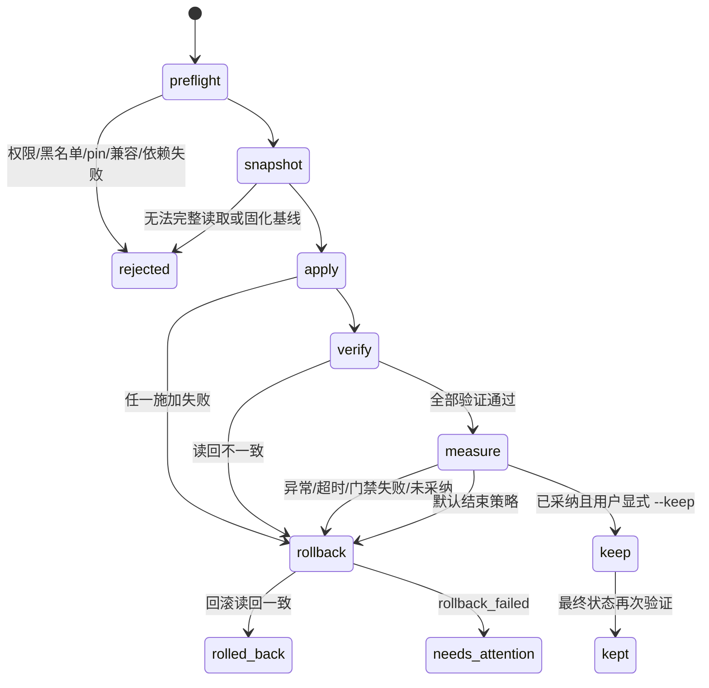
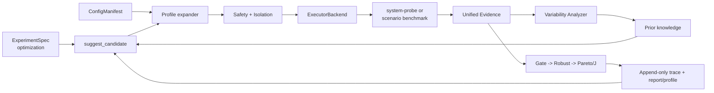

# Looper System Optimizer 协议与实施计划

> 状态：M0 已确认，M1 配置层实施中，2026-08-22。
>
> 本文只定义协议、边界、目录和验收方式，不代表 M1–M5 已实现。所有标为“待确认”的决策必须经人工评审后才能写入实现。真实 `local-linux` / `ssh-remote` 执行尚未验证且默认禁用。

## 1. 目标、证据边界与当前状态

System Optimizer 面向 Linux CVM guest 内的系统级配置，提供两条使用路径：

- 通用优化：运行内置轻量探针，搜索系统配置，产出 profile、分析报告和可重放证据。
- 场景优化：绑定已安装的 scenario benchmark，围绕主指标、SLO、goodput、尾延迟和稳定性搜索配置。

它不修改 hypervisor/宿主机，不做代码、编译器或内核补丁，不购买或销毁云资源，不运行 always-on 调优 daemon，也不在 M1–M5 引入 RL/LLM 调参。除非用户对已通过采纳判定的候选显式使用 `--keep`，每轮测量后都回滚到基线。

通用探针只证明“该探针特征下”的结果，不冒充腾讯云生产 workload 的代表性。场景 benchmark 的 adapter-only 状态也不等于真实 workload 已执行；执行成熟度必须继续沿用现有 `x-extensions.executionStatus` 语义。

### 1.1 已核验事实

M0 基于仓库当前实现核验了以下事实：

- `ExperimentSpec` 当前只有 `optimization` 与 `selection` 两种 mode，optimization 已承载搜索空间、baseline、目标、稳定性目标、门禁、实验设计、预算和优化器。
- `suggest_candidate(...)` 已是 grid/random/Optuna TPE/NSGA-II 的统一候选入口。
- `Variability Analyzer` 已提供分布分析与 `mean_better_tail_worse` 判定。
- `EnvironmentSnapshot`、Evidence Manifest、Derived Metric Ledger、CAS、worker fencing/capability/target affinity 已存在；系统调参要复用而不是另建平行真相源。
- 系统指纹已包含 governor/EPP/SMT/THP、tuning daemon、NUMA、swap、NIC、disk 等信息；不可获取项为 `null`，不能据此补推。
- 当前没有系统配置声明、施加、读回验证、补偿回滚、漂移守卫和优化轨迹协议。

论文数字、生产校准结论和系统行为只能作为设计依据，不能冒充本项目实测。最终结论仍以 M1–M5 的自动化测试、Windows simulated demo 和后续经授权的 Linux/CVM 实测为准。

### 1.2 M0 基线健康检查

| 检查 | 结果 | 口径 |
|---|---|---|
| `pnpm install` | 通过 | lockfile 未变化，workspace 已是最新 |
| `pnpm setup` | 通过 | 首次受限网络失败；获准联网后 editable install 与依赖检查通过 |
| `.venv\Scripts\python.exe -m pytest tests\ -x -q` | 通过 | 187 项通过；仅 `.pytest_cache` 无写权限警告，不影响用例结果 |
| M1 计划测试锚点 | 36 | 只计 `- 计划：tests/test_system_opt_...` 条目；此前 37 的原始文本匹配误计了目录树 `tests/test_system_opt_*.py` |
| 工作树基线 | 干净 | M0 修改前 `git status --short` 无输出；分支 `io500-suite` |

### 1.3 M0 结束复核的并发混杂与隔离结果

纯文档修改后使用共享 pytest 临时根目录全量复跑时，两次在 `tests/test_cloud_workflow.py::test_expired_order_can_renew_exact_confirmation_and_then_submit` 停止；用户补充其初跑 ERROR 同样发生在“共享 pytest 临时根目录 + 多 agent 并发”条件下。失败输出能证明 renewed 与 prepared token 相同，但不能在该混杂条件下区分环境争用和真实时间分辨率缺陷。**“Windows 上 prepare 与 renew 落在同一系统时钟 tick”仍是未验证推断，不作为根因结论。**

按用户要求，使用独立目录 `E:\wujiahao\CProjectAllStudies\TencentMiniProject\Looper\.looper\pytest-system-opt-m0-01a02968-513c-75c3` 作为 `--basetemp` 重跑全量，187/187 通过。因此结论更正为：**隔离环境下全绿；此前失败存在并发/临时目录混杂，不能定性为既有 flaky test。** 后续 M1 测试必须使用本轮唯一 basetemp，并遵守时间分片治理。

## 2. P0 决策记录

以下是设计提案，不是已批准默认值。

| ID | 问题 | 推荐方案与逻辑 | 影响/兼容策略 | 状态 |
|---|---|---|---|---|
| D0-01 | 系统配置如何进入实验 | 给 `ExperimentSpec` 增加可选 `system_tuning`，其中引用独立注册、digest 化的 `ConfigManifest`；不把清单内容复制进 benchmark manifest | 配置绑定进入 spec/policy/candidate 身份；字段缺失时必须保持旧 optimization 行为与 digest | 已确认 2026-08-22 |
| D0-02 | 是否增加第三种 mode | 不增加；复用 `optimization`。系统配置是执行层参数语义，不是新的统计实验范式 | 不分叉调度、分析、API 和前端；selection 不受影响 | 已确认 2026-08-22 |
| D0-03 | 系统与 benchmark 参数共存 | Candidate 保持一个 canonical 参数映射，但键使用 `system.<config-id>` 与 `benchmark.<parameter-id>` 命名空间；`when` 引用完整键 | 防止同名碰撞；需改 scheduler 的 benchmark-only 校验，并对旧无前缀 Candidate 保持兼容 | 已确认；M1 需兼容实测 |
| D0-04 | Candidate 身份 | 系统调参 Candidate digest 纳入 benchmark manifest digest、Config Manifest digest、展开后 profile digest 与 canonical 参数；无 `system_tuning` 时继续走 legacy digest 算法 | 防止同值但不同清单/配置档被误判为同一候选；回归测试锁定旧 digest | 已确认 2026-08-22 |
| D0-05 | “原子 apply”含义 | 定义为协议级补偿事务：依赖拓扑顺序施加，任一失败按逆序回滚；全部读回 verify 后才允许测量。不能宣称多个内核接口同时原子提交 | 避免把不可实现的内核级原子性写成事实；会出现 `rolled_back` / `rollback_failed` 终态 | 已确认 2026-08-22 |
| D0-06 | 管理员优先/pinned 判定 | 只接受显式 pin、目标策略或有所有权标记的配置为 `pinned`；单次指纹与清单默认值的差异只标 `ownership-unknown`，默认不碰 | 不把发行版默认误判成人工设置，也不静默覆盖未知配置 | 已确认；真实所有权来源仍未验证 |
| D0-07 | 稳健层 LCB 范围 | 显式声明一个或多个 `adoption_metrics`；它们的 LCB95 都必须 >0。其他 soft 目标可做 Pareto 权衡，但不能越硬门禁/稳定性界 | 若要求所有 Pareto 目标都改善，会消灭合法 trade-off；若未声明 adoption metric 则 fail closed | 已确认 2026-08-22 |
| D0-08 | 无改进早停 | 不设隐式轮数；缺省时只由 `BudgetSpec` 停止。用户显式声明 `no_improvement_rounds` 后才启用，且只统计证据充分的 feasible 候选 | 避免未经数据校准就过早停止；可能比固定 patience 多跑候选 | 已确认 2026-08-22 |
| D0-09 | `EnvironmentSnapshot` 扩展 | M4 增加可选 typed `appliedSystemConfig` 并同步 Pydantic/JSON Schema；legacy digest 计算明确忽略“缺失或 `None`”的新字段，新快照有值时才纳入 digest | 防止给旧模型加空字段后导致历史 digest 全变；必须用历史 fixture 回归证明 | 已确认 2026-08-22 |
| D0-10 | 真实后端启用 | `simulated` 是唯一默认启用后端；`local-linux` 与 `ssh-remote` 需要显式 feature flag、capability 和操作者授权 | Windows 可安全交付；真实 Linux/CVM 成熟度保持 `unverified` | 已由任务边界给定，M1 仍需测试 |
| D0-11 | 目录路径 | 沿用任务给定目录；核心纯逻辑在 `packages/core`，数据放 `profiles/`、`knowledge/priors/`，平台 I/O 留在 service 层 | 不建立第二套 optimizer/evidence 模块 | 已确认 2026-08-22 |
| D0-12 | 并发工作树治理 | 当前 dirty M0 文件按要求迁移到 `system-optimizer`；M1 采用严格时间分片，测试使用唯一 `--basetemp`，测试时用户停止 dev 栈，用户运行 dev 栈时本 agent 不改/测 | 避免共享工作树、pytest 临时根与运行进程发生真实碰撞；若未来改用 worktree，必须从 clean/已提交状态创建 | 用户前置条件；当前选时间分片 |

### 2.1 确认结果与 M1 前置条件

用户已于 2026-08-22 确认 M0 与 D0 推荐方案，并增加四项前置条件。执行结果：

1. 已执行 `git checkout -b system-optimizer origin/main`，dirty M0 文件保留；当前分支跟踪 `origin/main`。
2. 测试锚点更正为 36；第 37 个文本匹配是目录树 glob，不计入测试条目。
3. 使用独立 `--basetemp` 全量复跑 187/187 通过；撤销“既有 flaky test”定性，保留时钟假设为未验证推断。
4. M1 采用 D0-12 的严格时间分片；若无法确认独占时间片则暂停会修改/运行工作区状态的步骤。

## 3. P1 系统配置清单协议（Config Manifest）

### 3.1 定义

`ConfigManifest` 是可调系统状态的唯一声明源。它描述可读、可校验、可恢复的配置能力，不保存某轮候选值。整体采用 `looper.system-config-manifest/v1alpha1`，严格字段校验、canonical JSON 和 SHA-256 digest。

每个 `ConfigItem` 至少包含：

| 字段 | 语义 |
|---|---|
| `id` | 清单内稳定唯一标识；供 `system.<id>` 定位 |
| `category` | `sysctl/cpufreq/thp/io/net/numa/irq` 等允许值 |
| `value_type` / `domain` | boolean、integer、number、categorical 及上下界/步长/choices |
| `default` | 清单作者声明的候选默认，不等于目标机当前值或发行版默认 |
| `read` | argv 数组模板；禁止 shell 字符串和未声明占位符 |
| `apply` | argv 数组模板；只能引用 allowlist 中的值占位符 |
| `verify` | 读回解析器与等价比较规则；不允许只看退出码 |
| `rollback` | `restore-snapshot` 或显式 argv；优先恢复实际快照值而非清单 `default` |
| `activation` | `immediate` 或 `reboot` |
| `risk` | `low/medium/high`，high 必须有非空理由且默认不可搜索 |
| `dependencies` / `preconditions` | 其他项、文件/命令、内核模块、权限与 capability 条件 |
| `compatibility` | 内核版本、发行版、驱动和硬件条件；未知不等于兼容 |
| `searchable` | 能否进入搜索；reboot、blacklisted、不可回滚项必须为 false |
| `source` | 官方文档、论文或 `heuristic` 的来源与版本 |

读取和施加命令必须是 argv 数组，由 backend 执行；核心模型不启动进程。字符串、数值与布尔值先按声明域规范化，再进入命令模板和 digest，禁止 backend 自行猜测单位或别名。

### 3.2 最低配置覆盖计划

M1 数据清单至少包含 20 个经文档核对的真实配置项，并满足 sysctl、cpufreq/governor、THP、I/O、NUMA、network 各至少 3 项；IRQ affinity 与 MTU 也必须被覆盖。候选名称只能在核对目标内核/发行版实际接口后落盘，不能用下表的类别举例冒充已验证清单。

| 类别 | M1 最低数 | 验证重点 |
|---|---:|---|
| sysctl | 3 | 实际键存在、单位、边界、回滚读回 |
| cpufreq/governor/EPP | 3 | driver 与 governor/EPP 可用集合，频率接口所有权 |
| THP | 3 | bracket 当前值解析、defrag/shmem 兼容差异 |
| I/O | 3 | 每设备 scheduler/queue 作用域，虚拟盘能力 |
| NUMA | 3 | NUMA 节点数与接口存在性，进程级/系统级作用域 |
| network | 3 | NIC/namespace 作用域，MTU/拥塞控制失联风险 |
| IRQ/其他 | 2+ | affinity mask/CPU online 集合与回滚 |

### 3.3 注册校验与失败语义

- 缺 id、读取命令、验证规则、回滚语义或兼容条件：`manifest-invalid`，整份清单拒绝注册。
- id 重复、依赖不存在、依赖环、域内默认值越界：整份清单拒绝。
- `activation=reboot` 且 `searchable=true`：拒绝；reboot 项只能只读报告。
- high 风险无理由：拒绝；即使有理由也不自动解除运行时 waiver。
- 命中 P3 永久黑名单：可作为只读观测项登记，但不得有可执行 apply，也不允许 waiver。
- 当前值不可读、接口不存在或兼容性未知：不是零值；该项为 `unavailable`，候选在 preflight fail closed。
- digest 只由规范化内容产生，同一逻辑输入、键顺序不同必须得到相同 digest。

### 3.4 测试锚点

- 计划：`tests/test_system_opt_config_manifest.py::test_manifest_digest_is_canonical`
- 计划：`tests/test_system_opt_config_manifest.py::test_rejects_missing_read_and_out_of_domain_default`
- 计划：`tests/test_system_opt_config_manifest.py::test_rejects_reboot_item_in_search_space`
- 计划：`tests/test_system_opt_config_manifest.py::test_blacklisted_item_is_observation_only`
- 回归：现有 evidence/manifest canonical digest 测试不得变化。

## 4. P2 配置档协议（Tuning Profile）

### 4.1 定义与展开

profile 使用严格 YAML，schema 为 `looper.system-tuning-profile/v1alpha1`。它引用 Config Manifest digest，声明 include、variables、target conditions 与配置值，不复制命令。

```yaml
schemaVersion: looper.system-tuning-profile/v1alpha1
id: throughput-candidate
configManifestDigest: sha256:<digest>
includes: [baseline]
variables:
  targetNic: loopback
conditions:
  - fact: numa.nodeCount
    operator: greater-than
    value: 1
settings:
  system.vm-swappiness: 10
```

上例仅展示协议形态，不是已注册配置项，也不能在 M0 执行。

展开提案是：include 按声明顺序深度优先展开，后 include 覆盖前 include，当前 profile 再覆盖全部 include；同一层重复 key 拒绝。解析器检测 include 环和最大深度。变量只能来自 profile 显式 `variables` 与 backend 提供的只读目标事实，禁止隐式读取环境变量、shell 或网络。

条件使用固定 operator allowlist；条件所需事实为 `null`/未知时不猜测，返回 `condition-unresolved`，整次 apply fail closed。展开输出按 ConfigItem id 排序，包含所有最终值、来源 profile、覆盖链、condition 结果、manifest digest，并计算 `expandedProfileDigest`。

### 4.2 SearchParameter 映射

- `system.<config-id>` 必须能唯一映射到一个 `searchable=true`、`activation=immediate` 的 ConfigItem。
- SearchParameter 类型、范围、step、choices 必须是 ConfigItem domain 的相等或更窄子集。
- 反向查询必须能从 ConfigItem 找到所有引用它的 SearchParameter/profile。
- benchmark 参数继续由 benchmark manifest 定义；系统 profile 不得覆盖 `benchmark.*`。
- 未使用命名空间、映射歧义、域扩大、引用不同 manifest digest 均拒绝调度。

### 4.3 dry-run、apply 与 rollback

`dry-run` 只执行 probe/snapshot 与差异计算，输出 `current → requested`、风险、依赖顺序、pin/兼容/权限状态和预计回滚动作；不得执行 apply。profile 的 apply/rollback 只是 P3 状态机的批量输入，不绕过单项 verify 与事件记录。

### 4.4 失败语义

include 不存在/成环、变量未解析、条件未知、manifest digest 不匹配、参数域不兼容：profile 不展开且不产生部分结果。目标事实变化导致展开 digest 变化时，它是不同绑定，不能复用旧 Candidate 结果。

### 4.5 测试锚点

- 计划：`tests/test_system_opt_profiles.py::test_include_override_is_deterministic`
- 计划：`tests/test_system_opt_profiles.py::test_include_cycle_and_unresolved_condition_fail_closed`
- 计划：`tests/test_system_opt_profiles.py::test_dry_run_outputs_diff_without_apply`
- 计划：`tests/test_system_opt_profiles.py::test_search_parameter_mapping_is_bidirectional`

## 5. P3 安全协议（Safety Protocol）

### 5.1 状态机



“事务”只指协议级 all-or-rollback，不宣称跨多个内核接口的瞬时原子提交。apply 按依赖拓扑排序；同层按 id 稳定排序；rollback 按实际成功施加的逆序执行。

### 5.2 preflight

preflight 必须一次性报告而不是边施加边发现：

- backend、target affinity、fencing token、所需 capability、权限与目标身份；
- manifest/profile/candidate digest 一致性；
- 每项兼容性、接口可读性、值域、前置条件、依赖与回滚能力；
- 永久黑名单、风险 waiver、单轮变更数；
- explicit pinned 与 `ownership-unknown`；
- tuning daemon、cache mode 和 profiler 隔离条件。

单轮变更数默认上限为 5（来自任务给定安全约束），可配置得更小；提高上限需要实验级显式理由与操作者确认，不能由优化器自动提高。

### 5.3 永久黑名单与管理员优先

v1alpha1 永久拒绝：`kernel.panic*`、`vm.panic_on_oom`、SSH 可达性/认证设置、路由与转发核心项，以及 manifest 标注“可能导致目标失联且无带外恢复”的网络激进项。黑名单不可由普通 high-risk waiver 解除。

pin 来源必须记录为 `operator-policy`、`target-policy` 或可验证 ownership marker。只观察到“当前值不等于 manifest default”不能证明是人工设定；此时记 `ownership-unknown` 并跳过，等待用户决策。pinned/unknown 项不能因搜索建议而被静默删除或改写。

### 5.4 snapshot、verify 与回滚

- snapshot 覆盖候选涉及的全部项、依赖项、目标/系统指纹、tuning daemon 和命令解析版本；任何一项无法读取则不 apply。
- apply 每成功一项立即追加事件，但 measurement 只有全项 verify 后才能开始。
- verify 必须重新读取并按声明的 canonical comparator 比较，不能复用 apply 输出。
- 测量异常、超时、配置漂移、硬门禁失败、候选未采纳均自动回滚。
- rollback 恢复 snapshot 的实际旧值，不恢复 manifest default；随后逐项读回。
- 回滚失败追加 `rollback_failed`，目标状态置 `needs-attention`，禁止调度后续 attempt，绝不把失败记成已回滚。
- `--keep` 只允许已通过三层判定的候选，且需要用户显式请求；keep 后仍生成最终 snapshot/digest。

### 5.5 测试锚点

- 计划：`tests/test_system_opt_safety.py::test_blacklist_rejected_before_snapshot`
- 计划：`tests/test_system_opt_safety.py::test_verify_failure_rolls_back_in_reverse_order`
- 计划：`tests/test_system_opt_safety.py::test_timeout_rolls_back`
- 计划：`tests/test_system_opt_safety.py::test_pinned_and_unknown_ownership_are_untouched`
- 计划：`tests/test_system_opt_safety.py::test_rollback_failure_marks_target_needs_attention`
- 回归：worker fencing、target affinity 与 capability 测试继续通过。

## 6. P4 测量隔离协议

### 6.1 隔离守卫

每个测量窗口必须绑定以下不可变事实：

1. measurement 前采 `configDigestBefore`，后采 `configDigestAfter`；两者必须相同。
2. 前后系统指纹中参与比较的字段范围一致；不可得字段继续为 `null`，不得填补。
3. fingerprint 发现 tuned、power-profiles-daemon、TLP、bpftune 或其他 always-on 调优器时，状态为 `isolation-action-required`。优化器不自动停服务；操作者必须在策略中记录 `disabled-by-operator`，或显式说明允许及污染风险。未处置不得开始可采纳测量。
4. 复用 `ExperimentalDesign.cache_mode`，每个 attempt 记录实际执行的 cache 操作；无法执行声明模式则 attempt 无效。
5. profiler 只有在开销试验通过用户声明的上限后才能进入正式测量；没有开销证据时不得宣称 profiler 无扰动。
6. benchmark 阶段分别记录 prepare/warmup/run/close/cleanup，避免把 flush/cleanup 工作移出计时窗造成虚假收益。

### 6.2 漂移与污染失败语义

`configDigestBefore != configDigestAfter` 时追加 `config-drift`，attempt 作废，观测保留但不能进入 bootstrap、Pareto 或 J(x)。不自动猜测漂移来源；Analyzer/指纹只能生成待验证线索。若 drift 发生在 SSH 失联同时，状态为 `unknown`，执行尽力回滚但不自动重试。

### 6.3 测试锚点

- 计划：`tests/test_system_opt_isolation.py::test_tuning_daemon_requires_explicit_disposition`
- 计划：`tests/test_system_opt_isolation.py::test_digest_drift_invalidates_attempt`
- 计划：`tests/test_system_opt_isolation.py::test_cache_mode_failure_is_visible`
- 计划：`tests/test_system_opt_isolation.py::test_profiler_without_overhead_evidence_is_not_accepted`
- 回归：`tests/test_variability.py` 的 profiler 建议与分布分析语义不变。

## 7. P5 证据协议

### 7.1 不可变事件

每次 `probe/snapshot/apply/verify/measure/rollback/keep/drift` 追加事件，不更新旧事件。事件最少包含：

- schema/version、event id、experiment/candidate/evaluation/attempt/target id；
- worker id、operator/actor、fencing token、backend 与 capability；
- wall-clock 与 monotonic 顺序、前一个事件 digest；
- Config Manifest、展开 profile、candidate、environment 和 benchmark manifest digest；
- 参数 id、旧值、新值、argv（敏感值脱敏）、退出码/超时/解析结果；
- before/after/round-trip digest、结果状态与机器可读 reason code；
- 原始 stdout/stderr artifact 引用，而不是把大输出塞进事件。

事件 canonical 化后计算自身 digest，并以前一事件 digest 形成链。追加成功前不推进状态投影；状态投影可重建，不是事实源。

### 7.2 applied config 快照

M4 在 `EnvironmentSnapshot` 增加 optional typed `appliedSystemConfig`：清单/profile/candidate digest、已验证值、pin/unknown/unavailable 状态、backend、隔离状态和 config digest。Pydantic 模型与 JSON Schema 同步，只增不删。

兼容硬约束：旧 snapshot 未出现该字段时，环境 digest 必须逐字节保持原结果；不能因为模型默认序列化 `null` 改写历史身份。新增字段有值时才进入新 digest。实现前先固定至少一个历史 fixture 的 digest 回归测试。

### 7.3 优化轨迹与离线重放

`OptimizationTraceSnapshot` 按轮保存：baseline 选择、Analyzer 线索、prior 命中、候选建议、apply/verify、benchmark evidence、硬门禁、LCB/稳定性、Pareto/J(x)、采纳/回滚及理由。失败和中间候选同样保留。

离线 replay 输入固定为：不可变事件链、metrics/result/raw artifact digest、EnvironmentSnapshot、ExperimentSpec/policy digest、Config Manifest/profile digest、Analyzer/acceptance 代码版本。replay 只重算 derived result/decision，不执行系统命令或 benchmark；新策略产生新的 Analysis Snapshot，不覆盖旧结论。

### 7.4 失败语义

事件链缺口、digest 不匹配、必要 raw artifact 缺失、schema 不兼容或 evidence identity 不一致：replay fail closed 为 `insufficient-evidence`。不能用论文数字、缓存报告或人工描述填补缺失事实。

### 7.5 测试锚点

- 计划：`tests/test_system_opt_evidence.py::test_event_chain_is_append_only_and_digest_verified`
- 计划：`tests/test_system_opt_evidence.py::test_failed_trials_are_replayable`
- 计划：`tests/test_system_opt_evidence.py::test_legacy_environment_digest_is_unchanged`
- 计划：`tests/test_system_opt_evidence.py::test_replay_never_calls_executor`
- 回归：现有 unified evidence、trace evaluator、analysis snapshot 与 CAS 测试。

## 8. P6 Executor Backend 协议

### 8.1 纯接口与能力

核心接口不依赖 DB/网络：

| 方法 | 输入 | 输出/要求 |
|---|---|---|
| `probe` | target facts/query | typed 值或明确 unavailable；不能猜 |
| `snapshot` | item 集合 | 完整 canonical snapshot + digest；缺一即失败 |
| `apply` | 已解析 item/value、fence | 单项执行结果；必须可关联事件 |
| `verify` | expected、comparator | 独立读回结果 |
| `rollback` | actual snapshot、fence | 逐项恢复与读回状态 |

能力声明至少包括 backend kind、OS、privilege、supported categories、network reachability、out-of-band recovery、command timeout、target affinity 和 monotonic fencing。缺 capability 的 attempt 不可 claim。

### 8.2 三种实现的成熟度

| Backend | 默认 | M1/M4 范围 | 失败语义 |
|---|---|---|---|
| `simulated` | 启用 | 内存态；Windows 可跑；种子确定；注入 drift/failure/delay/rollback failure | 注入行为全部留事件，不触碰宿主系统 |
| `local-linux` | 禁用 | M1 做命令构造与 fake-runner 单测；真实权限/发行版测试另行授权 | 非 Linux、未显式启用或权限不足均 preflight 拒绝 |
| `ssh-remote` | 禁用、未验证 | M1 做命令构造；M4 接服务/能力；不自动创建 CVM | 失联后尽力回滚并置 `unknown`，绝不自动重试 |

所有命令使用 argv 数组和占位符白名单，禁止通过 shell 拼接 candidate 值。SSH 凭证只在执行进程安全边界内存在，不进入日志、事件、DB、artifact 或浏览器。

### 8.3 simulated 确定性

同一初态、清单、候选、seed 与 failure schedule 必须产生相同状态转换、metrics fixture 与事件顺序；时间戳等易变字段从 content digest 排除但仍保存在记录中。注入计划本身进入 policy digest。

### 8.4 测试锚点

- 计划：`tests/test_system_opt_executor.py::test_simulated_same_seed_same_trace`
- 计划：`tests/test_system_opt_executor.py::test_simulated_injects_drift_delay_and_failure`
- 计划：`tests/test_system_opt_executor.py::test_real_backends_are_disabled_by_default`
- 计划：`tests/test_system_opt_executor.py::test_command_construction_uses_argv_and_allowlisted_placeholders`
- 计划：`tests/test_system_opt_executor.py::test_ssh_disconnect_is_unknown_and_not_retried`

## 9. P7 先验知识协议

### 9.1 知识条目

`knowledge/priors/*.yaml` 的每条记录包含：Analyzer signal、适用上下文、排除条件、动作或显式 `no-action`、引用的 ConfigItem ids、来源类型、来源定位、置信标签和说明。

来源类型只有 `paper`、`official-doc`、`heuristic`。VGO Table 1 的映射可标 paper；运维经验必须标 `heuristic`，不能伪装成论文结论。`cycles` 等结果/后果指标不得直接作为因果动作触发器；关联只生成假设，采纳仍依赖前后分布实测。

### 9.2 对搜索的唯一影响

prior 只能：

- 排序尚未评估的合法候选；
- 生成 Optuna warm-start/initial candidate；
- 缩小到 Config Manifest 已允许的域内值；
- 解释为什么建议一次控制变量 A/B。

prior 不得绕过黑名单、pin、compatibility、GateSpec、LCB、稳定性、offered-load、漂移或预算规则，也不能直接把候选标成 accepted。

### 9.3 完整性与失败语义

Analyzer 暴露的每种受支持 signal 都必须映射到动作或显式 `no-action`。引用不存在/不可搜索 ConfigItem、来源缺失、条件冲突或 action 越域时整条 prior 拒绝；其他合法条目仍可加载，但错误必须汇报，不能静默丢弃。

### 9.4 测试锚点

- 计划：`tests/test_system_opt_priors.py::test_every_analyzer_signal_has_action_or_no_action`
- 计划：`tests/test_system_opt_priors.py::test_source_is_required_and_heuristic_is_visible`
- 计划：`tests/test_system_opt_priors.py::test_prior_cannot_bypass_safety_or_gates`
- 计划：`tests/test_system_opt_priors.py::test_consequence_metric_does_not_trigger_causal_action`

## 10. P8 统计、采纳与停止规则

### 10.1 统计输入

复用 `ExperimentalDesign` 的 warmup、min/max repeats、confidence level、bootstrap resamples、`baseline_every_n`、tail minimum samples、cooldown 和 cache mode；复用 `BudgetSpec` 的 candidate/attempt/wall-time 上限。周期性 baseline 必须通过同一安全和隔离协议，不能使用陈旧 baseline 值。

只有满足以下条件的 observation 进入统计：execution/correctness evidence 完整、单位匹配、offered-load 达成、无 fallback、无配置漂移、阶段证据完整、硬门禁所需字段可用。缺数据不是零，记 `insufficient-evidence`。

### 10.2 三层判定

#### 第一层：不可补偿硬门禁

按 `GateSpec` 依次检查 execution、correctness、safety、availability、SLO、resource 与 statistical gate；任一 false 或必要证据 unknown 时 candidate infeasible，不进入 Pareto/J(x)。

- 在线场景必须以 SLO-goodput/成功提交工作为准，并验证 offered-load achievement；降低请求量、关闭 correctness、走等价 fallback 不得换取高分。
- 多种子正确性按场景声明执行；Atrex 风格可用 K=5，但不把 K=5 擅自套给所有 benchmark。
- 若存在相同口径的 unloaded/loaded latency，`loaded >= 2 × unloaded` 标记资源饱和并触发 resource gate；指标不存在时为 not-evaluated，不能宣称未饱和。
- 理论上界与单位 sanity check 失败是证据/正确性问题，不进入统计。

#### 第二层：稳健层

对每个显式 adoption metric，用现有 paired 或 placement-cluster bootstrap 计算方向归一的收益 LCB95；`lower <= 0` 不采纳。样本不足、配对不完整或 placement identity 不一致为 insufficient evidence。

同时检查：

- hard `StabilityObjectiveSpec` 的 CV、p99/tail/variance 界；
- `compare_distributions` 状态；`mean_better_tail_worse` 必须输出 `requires-human-decision`，永不自动选边；
- signal/noise：收益置信区间必须脱离 0，且若实验声明 `minimum_effect_ratio`，点估计还必须达到它；未声明时不擅自使用固定 5%；
- 聚合敏感性：mean、median、配对胜出次数结论冲突时标 `aggregation-sensitive`，不自动采纳；
- 一致性：所有实验声明为 required 的重复/种子/环境块都必须 valid。BenchTrust 式“全过”是规则形态，不硬编码“12 次”。

#### 第三层：Pareto 与业务决胜

先在 feasible + robust 集合上用已有 NSGA-II/Pareto。J(x) 只排序同一 Pareto 层：

`J(x)=Σ wᵢ·LCB95(ΔUᵢ) − λ₁·CVaR99 − λ₂·CV − λ₃·worstCrossEnvRegression − λ₄·Cost − λ₅·Energy`

权重/λ 必须由用户在 experiment spec 显式给出，优化器不替用户设业务权重。缺成本、能耗或跨环境证据时对应项为 unavailable 并从可比较决胜中移除，不能填 0；若因此无法公平排序，则只返回 Pareto 集合而不宣布唯一赢家。任何 J(x) 高分都不能补偿前两层失败。

### 10.3 候选决策状态

| 状态 | 含义 | 后续动作 |
|---|---|---|
| `infeasible` | 硬门禁失败/未知 | 回滚，不入 Pareto |
| `insufficient-evidence` | 重复、单位、配对或必要 artifact 不足 | 回滚；预算允许可增加证据，不当失败或成功猜测 |
| `not-robust` | LCB≤0 或稳定性硬界失败 | 回滚，不入 Pareto |
| `requires-human-decision` | 均值/尾部冲突或聚合敏感 | 回滚为默认；记录两边证据，等用户决定 |
| `pareto-candidate` | 前两层通过且在 Pareto 集合 | 进入层内业务排序/人工选择 |
| `accepted` | 前两层通过且由显式规则选中 | 默认仍回滚；只有用户 `--keep` 才保留 |

### 10.4 停止规则

停止按先发生者：安全/目标 `needs-attention`、BudgetSpec 达限、用户取消、搜索空间穷尽、或显式 no-improvement 规则。`baseline_every_n` 周期基线进入 attempt 预算和 wall time。

提议 no-improvement 缺省禁用。若声明 `no_improvement_rounds=N`，只把“证据充分、硬门禁通过且完成稳健判定”的连续候选计入 N；infeasible、insufficient-evidence、基线轮和系统故障不计为“无改进”。“改进”指 adoption metric 的最佳 LCB 或当前 Pareto frontier 有严格改善。早停前必须完成下一次周期 baseline；若 baseline 漂移，停为 `baseline-drift` 而不是 `converged`。

### 10.5 测试锚点

- 计划：`tests/test_system_opt_acceptance.py::test_gate_failure_never_enters_pareto`
- 计划：`tests/test_system_opt_acceptance.py::test_non_positive_lcb_is_not_adopted`
- 计划：`tests/test_system_opt_acceptance.py::test_mean_better_tail_worse_requires_human_decision`
- 计划：`tests/test_system_opt_acceptance.py::test_missing_cost_energy_are_not_zero`
- 计划：`tests/test_system_opt_loop.py::test_baseline_every_n_and_budget_stop`
- 计划：`tests/test_system_opt_loop.py::test_no_improvement_counts_only_evidence_sufficient_candidates`
- 回归：现有 `test_stability_objectives.py`、variability、bootstrap/selection analysis 测试。

## 11. 组件关系与端到端流程



VGO 六步在 Looper 中对应：基线分布 → Analyzer 采集/分类/归因 → prior + `suggest_candidate` → P3 安全施加 → benchmark 重测 → P8 比较与回滚/采纳。搜索器不执行系统命令；backend 不做统计决策；report 不成为证据事实源。

## 12. 目录树与职责规范

M0 只创建本文、根 README 章节和模块 README；下列 `.py`、数据、探针与 service 文件在用户确认后按里程碑创建。

```text
packages/core/looper_core/system_opt/
  README.md
  __init__.py
  config_manifest.py
  profiles.py
  safety.py
  isolation.py
  opt_evidence.py
  executor/
    __init__.py
    simulated.py
    local_linux.py
    ssh_remote.py
  priors.py
  loop.py
  acceptance.py
  report.py
profiles/
  baseline.yaml
  throughput.yaml
  latency.yaml
  scenario/*.yaml
knowledge/priors/
  variability_mitigations.yaml
benchmarks/system-probe/
services/api/looper_api/system_opt_service.py
apps/web/src/pages/SystemOptPage.tsx       # M4 可选，API/证据先行
tests/test_system_opt_*.py
docs/system-optimizer.md
docs/system-optimizer-demo.md              # M5 运行实录
```

目录约束：

- `packages/core` 只含纯模型、校验、状态机与计算，不依赖 DB、HTTP、SSH 库或 FastAPI。
- `profiles/` 与 `knowledge/` 是版本化数据，不把 recipe/论文映射硬编码进 Python。
- 进程、SSH、凭证、DB、事件投影和 API 编排放 service/worker 边界；core 只依赖注入的 backend protocol。
- benchmark 仍遵守六阶段、trust、标准 metrics/result 和 execution maturity 契约。
- 现有 optimizer、variability、evidence、fingerprint、worker 安全组件是唯一复用入口，不复制实现。

## 13. 每目录/模块验收表

状态口径：`M0-spec` 表示验收标准已落档但实现未开始；不是通过。

| 目录/模块 | 职责一句话 | 验收标准（可执行检查） | 状态 |
|---|---|---|---|
| `system_opt/config_manifest.py` + Config Manifest 数据 | 严格声明可调项并生成稳定身份 | ≥20 个真实项；六个指定类别各≥3，另含 IRQ/MTU；非法域/缺 read/high 无理由/reboot searchable/blacklist apply 均拒；同输入 digest 稳定 | M0-spec |
| `system_opt/profiles.py` + `profiles/` | 确定展开、条件化和 dry-run profile | include/覆盖/环检测/变量/未知条件测试；同输入展开一致；dry-run 有 diff 且 apply 调用数为 0；SearchParameter 双向可查 | M0-spec |
| `system_opt/safety.py` | 执行补偿事务和回滚保证 | 黑名单、verify 失败、超时、pinned/unknown、rollback_failed 五个专门测试；单轮上限与反向回滚可断言 | M0-spec |
| `system_opt/isolation.py` | 隔离 tuning daemon、cache/profiler 与配置漂移 | daemon 未处置拒测；前后 digest 不同使 attempt 无效且 reason 可见；cache/profiler 失败不进统计 | M0-spec |
| `system_opt/opt_evidence.py` | 追加事件链、applied snapshot 与离线 replay | 篡改任一事件验证失败；失败 trial 可重放；replay 不调用 executor；legacy environment digest fixture 不变 | M0-spec |
| `system_opt/executor/simulated.py` | Windows 安全模拟系统状态 | 注入 drift/delay/apply/verify/rollback failure；同 seed 同 trace；Windows E2E 可跑 | M0-spec |
| `system_opt/executor/local_linux.py` | 构造本机 Linux 操作 | argv 构造/fake runner 单测；非 Linux/默认禁用 fail closed；README 显示未真实验证 | M0-spec |
| `system_opt/executor/ssh_remote.py` | 构造远程 CVM 操作 | argv/凭证脱敏/fence/capability 单测；默认禁用；失联 unknown、尽力回滚、无自动重试 | M0-spec |
| `system_opt/priors.py` + `knowledge/priors/` | Analyzer 线索到候选动作的有来源映射 | 每种 signal 有 action/no-action；来源完整；heuristic 可见；越域/绕门禁被拒；cycles 等后果指标不触发动作 | M0-spec |
| `system_opt/loop.py` | VGO 六步主循环与预算调度 | simulated ≥10 轮收敛或优雅耗尽预算；`baseline_every_n` 生效；失败候选保留但不进 Pareto；每轮可 replay | M0-spec |
| `system_opt/acceptance.py` | 实现硬门禁、稳健层与 Pareto/J | 每一决策分支测试；LCB≤0 不采纳；mean/tail 冲突只报人工决策；缺成本/能耗不填 0 | M0-spec |
| `system_opt/report.py` | 从证据生成 profile 与人读报告 | 报告引用 digest/reason；不把推测写成实测；只从 accepted 候选导出 keep/profile；同 snapshot 可复算 | M0-spec |
| `benchmarks/system-probe/` | 提供通用优化轻量目标函数 | trusted demo 级注册；六阶段；CPU/内存/文件 I/O/loopback/syscall 混合；metrics/result 过 schema；Windows 可跑；明确非生产代表 | M0-spec |
| API service | 注册/启动/查询优化与事件投影 | 请求/响应严格 schema；禁用后端不可启动；事实 append-only；状态可重建；API 不执行系统命令 | M0-spec |
| Web（M4 可选） | 展示配置 diff、状态、证据与人工决策 | 不隐藏 risk/rollback/drift/unknown；不能从浏览器启用真实 backend；E2E 覆盖关键状态 | M0-spec |
| `docs/` 与 READMEs | 对外定义边界、使用和审计 | P1–P8 均有测试锚点；Windows 三命令实测记录；真实后端成熟度准确；demo 文档含命令/输出/digest | M0-spec；本文/README 已落盘 |
| 总体 | 保证兼容与可交付 | 旧 optimization/selection 测试全绿；新单测全绿；README 三命令可复现；验收行全部转为 passed 才算完成 | M0-spec |

## 14. 分阶段实施与每阶段交付

### M0：协议评审门（本轮）

- 交付：本文、根 README 章节、模块 README、目录/验收表。
- 不交付：Python/TypeScript 实现、profile 数据、API、探针或可运行 demo。
- 出口：用户确认 P0 选择；未确认不得进入 M1。

### M1：配置与安全底座

- 实现 P1/P2/P3/P6 simulated 与真实 backend 命令构造。
- 先做 schema/model/digest，再做数据清单与 profile，再做状态机/backend。
- 交付单元测试、非法输入 fixture 和 legacy optimization 回归证据。

### M2：通用闭环

- 实现 system-probe、loop、P8 acceptance、report、CLI。
- Windows simulated demo 至少 10 轮，覆盖正常、门禁失败和回滚路径。
- 产出 profile、报告、证据包；README 三命令此时才从“目标接口”改为“已验证”。

### M3：场景闭环

- 先用 BenchBase/DCPerf adapter-only 数据演练轨迹，不把演练写成真实执行。
- 接 stability objectives、priors、offered-load/goodput 与 `compare_distributions`。
- 真实 workload 需要 runner/image/权限成熟度另行验证。

### M4：平台集成

- API、事件投影、EnvironmentSnapshot typed 扩展与 Pydantic/JSON Schema 双写。
- 前端为可选最后项；API/证据优先。
- local-linux/ssh 继续默认禁用并标未验证。

### M5：收尾

- 全量测试、文档/示例同步、Windows 三命令复核、`docs/system-optimizer-demo.md` 实录。
- 只有用户明确要求才 git commit；不 push。

## 15. 源方法到产品规则的边界

| 来源 | 可复用的已核验方法 | 本项目不能直接宣称的内容 |
|---|---|---|
| BenchTrust | 重复有效性、噪声/聚合敏感性审计 | 未在 Looper 数据上实测前，不能宣称某阈值已可靠 |
| CCL-Bench | 失败/中间 trial 也留存、raw trace 与 derived metric 分离 | 不能把 CCL 规模数字当本项目容量结论 |
| DCPerf | 生产校准与微架构/系统特征一致性思想 | 未获得腾讯生产画像前不能声称“腾讯生产代表性” |
| VGO | 分布→归因假设→缓解→复测六步；均值/方差可能冲突 | 关联线索不是因果结论，prior 不能直接采纳 |
| CloudyBench | 多维指标与成本视角 | 本项目按导师规则将可用性/正确性/SLO 保持硬门禁，不照搬 O-score 补偿 |
| Atrex | correctness-before-performance、反 fallback、测量净化 | 不把 GPU 特定 K=5/roofline 细节无条件套到 CPU 场景 |
| MESS/纠错工作 | 饱和区、配置披露、sanity check | 不站队宣称某模拟器结论，除非本项目复测 |
| SPEC CPU2026 | 特征聚类与代表子集 | M1–M5 不实现自动子集选择 |
| IO500 特征化 | phase-level 下钻与 straggler/close 证据 | 相关性不证明 benchmark 阶段冗余或因果 |
| TailBench++ | 动态客户端/QPS、尾延迟实验设计 | 重复≥13等论文口径不自动成为所有场景默认值 |

## 16. 未来引擎/未采纳思路 backlog

| 思路 | 来源 | 暂不采纳理由 | 未来插口 |
|---|---|---|---|
| 特征聚类选择快速探针子集 | SPEC CPU2026 | 需先积累足够跨环境特征数据；M1–M5 优先闭环正确性 | probe planner |
| 分区采样/降维/偏置 warm-start | BestConfig/OtterTune/LlamaTune | 项目实现已停滞或假设不同；先验证现有 Optuna | candidate provider |
| SMAC | MLOS 形态 | 现有 TPE/NSGA-II 已足够交付，增加引擎会扩大测试面 | optimizer registry |
| RL 调参 | 腾讯 CDBTune | 需要训练数据、奖励治理与生产验证；超出当前范围 | optimizer registry |
| Agentic/约束 RL | TuneAgent/OS-R1 | 可审计性、动作安全与数据需求尚不满足 | proposal provider only |
| always-on eBPF 调优 | bpftune | 会污染 benchmark 测量且与显式批量/回滚产品形态冲突 | 不纳入当前产品 |
| 主机/hypervisor/内核 patch | PERFOPT-Bench 方向 | 超出 guest 权限、安全和当前交付边界 | 上层课题另立项 |

## 17. M0 评审清单

- [x] 用户确认 D0-01 至 D0-09、D0-11。
- [x] 用户确认三层判定中 adoption metrics 的 LCB 范围。
- [x] 用户确认 `ownership-unknown` 的 fail-closed 语义。
- [x] 用户确认无隐式 early-stop patience。
- [x] 分支迁移到 `system-optimizer`，未提交 M0 文件保留。
- [x] 锚点计数更正为 36，并记录误差来源。
- [x] 独立 `--basetemp` 全量复跑通过，flaky 定性更正。
- [x] M1 并发治理采用严格时间分片。
- [x] M0 评审门通过，可以创建 M1 实现模块、数据清单与测试。
